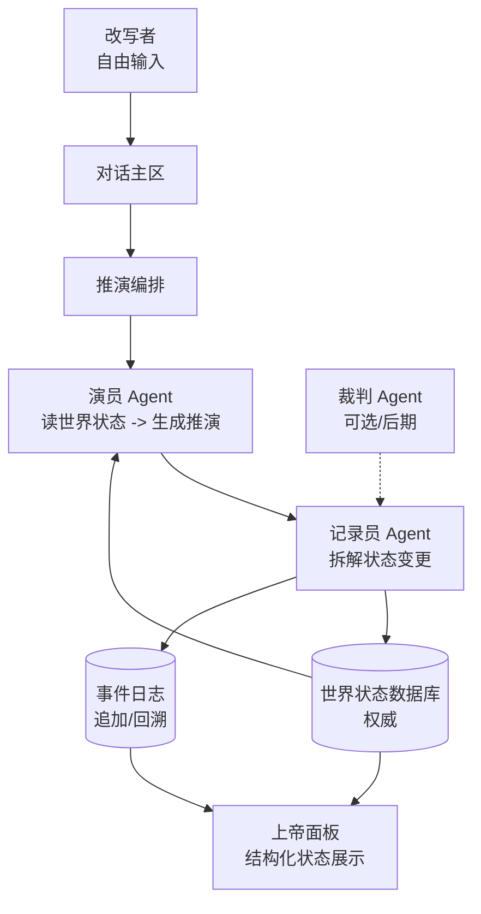

<div align="center">

# 🏯 Sandtable

**通用世界推演沙盘（工作名）-- 自定义世界，AI 实时推演走向**

[](LICENSE)
[](https://www.typescriptlang.org/)
[](https://nodejs.org/)
[](https://react.dev/)
[](https://fastify.dev/)
[](https://vitest.dev/)
[](CONTRIBUTING.md)

[简体中文](README.md) | [文档总览](docs/README.md)

</div>

---

## 目录

- [项目简介](#项目简介)
- [核心特性](#核心特性)
- [架构总览](#架构总览)
- [技术栈](#技术栈)
- [项目结构](#项目结构)
- [快速开始](#快速开始)
- [开发指南](#开发指南)
- [测试](#测试)
- [部署](#部署)
- [路线图](#路线图)
- [参与贡献](#参与贡献)
- [行为准则](#行为准则)
- [安全政策](#安全政策)
- [许可证](#许可证)
- [致谢](#致谢)

---

## 项目简介

**Sandtable**（工作名：通用世界推演沙盘）让用户从自己定义的世界设定出发，自由输入改写，由 AI 实时推演后续走向：定义世界设定 → 在对话中自由输入任意改写 → 演员 Agent 根据当前世界状态推演结果 → 记录员 Agent 把状态变更写回结构化数据库 → 继续输入，循环往复。

### 为什么做这个项目？

> “如果世界的规则或条件改变，接下来可能发生什么？”

Sandtable 用结构化的世界状态数据库与不可变的事件日志，保证 AI 推演可追溯、世界状态一致，让用户探索任意设定下的因果变化，而非仅生成一段续写故事。

### 项目状态

> ⚠️ **当前阶段：技术原型（Prototype）**

本项目已完成技术框架搭建（monorepo、React 前端外壳、Fastify API、Worker、共享领域协议），尚未实现推演业务逻辑。1.0 目标是跑通"自由输入改写 → AI 合理推演 → 状态一致性有保障"，不做过度设计。详见[路线图](#路线图)与[1.0 范围](#10-范围)。

---

## 核心特性

### 🗣️ 自由对话式改写

用户在对话中输入任意颗粒度的世界改写，由 AI 根据当前世界状态推演后果。不是选择题，也不是结构化指令。

### 🎭 多 Agent 推演分工

演员 Agent 读取世界状态生成叙事推演，记录员 Agent 把推演结果拆解为结构化状态变更写回数据库；裁判 Agent 可选，1.0 默认不启用。

### 🗄️ 结构化世界状态权威

世界状态以结构化数据库为唯一权威，不依赖对话上下文记忆，避免长对话中的遗忘与漂移。

### 📜 事件日志可回溯

每次改写与推演作为独立事件追加到不可变日志，支持按顺序回溯因果链。

### 👁️ 上帝面板

常驻展示当前世界结构化状态，让用户始终看清推演背后的世界变化。1.0 仅作展示，不直接改写世界。

### 🎯 1.0 不过度设计

只跑通"自由输入 → AI 推演 → 状态一致性"。权限分层、迷雾/代价机制、规则裁决引擎、确定性重放、显式世界线分支均留待后续迭代。

---

## 架构总览

Sandtable 采用 **TypeScript 模块化单体** 架构，以"AI 驱动推演，结构化数据库驱动世界状态"为分层方式：演员 Agent 读取世界状态生成推演，记录员 Agent 拆解状态变更写回数据库，事件日志保证可回溯。



### 模块

| 模块                        | 职责                                                               |
| :-------------------------- | :----------------------------------------------------------------- |
| **世界设定与入口模块**      | 接收用户世界设定，产出通用初始世界状态；不预测推演结果             |
| **对话与推演编排模块**      | 接收自由文本改写，协调演员/记录员 Agent 完成推演循环，写入事件日志 |
| **演员 Agent**              | 读取当前世界状态与改写，生成叙事推演                               |
| **记录员 Agent**            | 把推演结果拆解为结构化状态变更，写回世界状态数据库，产出事件记录   |
| **裁判 Agent**（可选/后期） | 检查推演前后矛盾；1.0 默认不启用                                   |
| **世界状态数据库**          | 结构化持久化人物、势力、资源、地理、关系等要素，唯一权威           |
| **事件日志**                | 每次改写与推演作为独立事件追加，不可原地修改，支持回溯             |
| **上帝面板**                | 常驻展示当前世界结构化状态；1.0 只读                               |

### 核心不变量

1. 只有**记录员 Agent**能写回世界状态数据库；演员 Agent 不直接写状态
2. 每次改写与推演必须追加为**事件日志**中的独立事件，不可原地修改
3. 世界状态以**结构化数据库**为权威，不依赖对话上下文记忆
4. 推演读取当前世界状态，结果可追溯到本次改写
5. 模型、提示词或 Agent 框架升级**不得静默改变**已有事件日志的语义
6. 上帝面板 1.0 只读，不构成第二条世界写入路径
7. Agent 默认无任意网络/Shell/文件权限，仅可读写世界状态数据库与事件日志

> Agent 框架（D007）、模型路由（D014）、Agent 接入方式（D015）、数据存储技术（D016）为待定决策，详见 [架构决策](docs/adr/) 与 [决策清单](docs/decision-register.md)。

---

## 技术栈

### 核心运行时

| 技术                                          | 版本      | 用途                                     |
| :-------------------------------------------- | :-------- | :--------------------------------------- |
| [TypeScript](https://www.typescriptlang.org/) | 7.x       | 全栈语言（前端、后端、Worker、共享协议） |
| [Node.js](https://nodejs.org/)                | ≥ 22.19.0 | 服务端运行时                             |

### 前端（`apps/web`）

| 技术                                                 | 版本 | 用途           |
| :--------------------------------------------------- | :--- | :------------- |
| [React](https://react.dev/)                          | 19.x | UI 框架        |
| [React Router](https://reactrouter.com/)             | 7.x  | 客户端路由     |
| [TanStack Query](https://tanstack.com/query)         | 5.x  | 服务端状态管理 |
| [Vite](https://vite.dev/)                            | 8.x  | 构建工具       |
| [vite-plugin-pwa](https://vite-pwa-org.netlify.app/) | 1.x  | PWA 支持       |

### 后端（`apps/api`）

| 技术                            | 版本 | 用途      |
| :------------------------------ | :--- | :-------- |
| [Fastify](https://fastify.dev/) | 5.x  | HTTP 框架 |

### Worker（`apps/worker`）

| 技术                                                  | 版本   | 用途                                |
| :---------------------------------------------------- | :----- | :---------------------------------- |
| [Pi AI](https://github.com/earendil-works/pi)         | 0.80.x | 多模型 AI 层（当前选型，D007 待定） |
| [Pi Agent Core](https://github.com/earendil-works/pi) | 0.80.x | Agent 循环、工具执行                |

### 开发工具

| 技术                                        | 版本 | 用途                |
| :------------------------------------------ | :--- | :------------------ |
| [Vitest](https://vitest.dev/)               | 4.x  | 测试框架            |
| [Prettier](https://prettier.io/)            | 3.x  | 代码格式化          |
| [tsx](https://github.com/privatenumber/tsx) | 4.x  | TypeScript 直接执行 |
| npm workspaces                              | -    | Monorepo 管理       |

### 规划中的基础设施

| 技术                                      | 用途                           |
| :---------------------------------------- | :----------------------------- |
| [PostgreSQL](https://www.postgresql.org/) | 世界状态数据库、事件日志、账户 |
| [Redis](https://redis.io/)                | 队列、缓存、限流               |
| S3 兼容存储                               | 附件、导出                     |
| OIDC/OAuth                                | 身份认证                       |
| OCI 容器                                  | 部署                           |

---

## 项目结构

```
sandtable/
├── apps/
│   ├── web/                    # React + Vite 前端（对话主区 + 上帝面板）
│   │   ├── src/
│   │   │   ├── api/            # API 客户端（SSE 推演流、状态查询）
│   │   │   ├── components/     # UI 组件（事件日志、上帝面板）
│   │   │   ├── pages/          # 页面（首页、推演页）
│   │   │   ├── App.tsx         # 路由
│   │   │   ├── main.tsx        # React 入口
│   │   │   ├── session.ts      # 会话与场景元数据
│   │   │   └── styles.css      # 移动端优先样式
│   │   ├── index.html
│   │   ├── package.json
│   │   └── vite.config.ts
│   │
│   ├── api/                    # Fastify HTTP API
│   │   ├── src/
│   │   │   ├── app.ts          # Fastify 应用工厂
│   │   │   ├── server.ts       # 服务入口
│   │   │   ├── log.ts          # 结构化日志
│   │   │   ├── metrics.ts      # 指标端点
│   │   │   └── security.ts     # 安全中间件（限流、校验、响应头）
│   │   └── package.json
│   │
│   └── worker/                 # AI 推演与多 Agent 后台 Worker
│       ├── src/
│       │   ├── index.ts        # Worker 入口
│       │   ├── pi-runtime.ts   # Pi 运行时接入
│       │   └── status.ts       # 状态查询
│       └── package.json
│
├── packages/
│   ├── domain/                 # 共享领域协议（世界状态、事件日志、Agent 协议）
│   │   ├── src/
│   │   │   ├── index.ts        # 统一导出
│   │   │   ├── ids.ts          # 品牌化 ID 类型
│   │   │   ├── world-state.ts  # 世界状态 schema
│   │   │   ├── events.ts       # 事件日志 schema
│   │   │   ├── agents.ts       # Agent 协议接口
│   │   │   ├── state-core.ts   # 状态应用内核（变更应用、回溯）
│   │   │   ├── orchestrator.ts # 推演编排（事务、幂等）
│   │   │   ├── scenarios/      # 自定义世界起点工厂
│   │   │   └── stubs/          # 桩 Agent（无模型时使用）
│   │   └── package.json
│   │
│   ├── agents/                 # Agent 推演实现（DeepSeek LLM 客户端）
│   │   ├── src/
│   │   │   ├── index.ts        # 统一导出
│   │   │   ├── llm.ts          # LLM 客户端接口
│   │   │   ├── deepseek.ts     # DeepSeek API 客户端
│   │   │   ├── model-actor.ts  # 模型演员 Agent
│   │   │   ├── model-recorder.ts # 模型记录员 Agent
│   │   │   ├── prompts.ts      # 提示词模板
│   │   │   └── validate.ts     # 输出校验
│   │   └── package.json
│   │
│   └── persistence/            # SQLite 持久化层
│       ├── src/
│       │   ├── index.ts        # 统一导出
│       │   ├── open.ts         # 数据库连接
│       │   ├── schema.ts       # DDL 定义
│       │   ├── migrate.ts      # 迁移
│       │   ├── sqlite-world-state-store.ts
│       │   └── sqlite-event-log.ts
│       └── package.json
│
├── docs/                       # 项目文档
│   ├── README.md               # 文档总览与阅读顺序
│   ├── architecture.md         # 系统架构
│   ├── product-vision.md       # 产品愿景
│   ├── world-model.md          # 世界状态与事件
│   ├── mvp.md                  # 1.0 范围
│   ├── roadmap.md              # 路线图
│   ├── development.md          # 本地开发指南
│   ├── development-plan.md     # 开发计划
│   ├── decision-register.md    # 决策清单
│   ├── adr/                    # 架构决策记录
│   ├── agents/                 # Agent 协作文档
│   └── templates/              # 文档模板
│
├── AGENTS.md                   # AI Agent 协作规则
├── CONTEXT.md                  # 领域语言规范（术语表）
├── CONTRIBUTING.md             # 贡献指南
├── CODE_OF_CONDUCT.md          # 行为准则
├── SECURITY.md                 # 安全政策
├── CHANGELOG.md                # 变更日志
├── LICENSE                     # AGPL-3.0 许可证
├── package.json                # Monorepo 根配置
├── tsconfig.base.json          # 共享 TypeScript 配置
└── vitest.config.ts            # 共享测试配置
```

---

## 快速开始

### 环境要求

- **Node.js** >= 22.19.0
- **npm**（随 Node.js 附带）

> 💡 所有依赖、缓存和构建产物均位于项目目录内，无需全局安装任何包。

### 安装

```bash
# 克隆仓库
git clone https://github.com/daum110715/sandtable.git
cd sandtable

# 安装依赖
npm install
```

### 启动开发服务

```bash
# 启动前端 PWA（默认 http://localhost:5173）
npm run dev:web

# 启动 API 服务（热重载）
npm run dev:api

# 启动 Worker（热重载）
npm run dev:worker
```

### 验证项目

```bash
# 完整验证：类型检查 + 测试 + 生产构建
npm run check
```

> **Windows 用户注意：** 如果 PowerShell 禁止 `npm.ps1`，请使用 `npm.cmd run check`。

---

## 开发指南

### 可用脚本

| 命令                   | 说明                               |
| :--------------------- | :--------------------------------- |
| `npm run dev:web`      | 启动前端 PWA 开发服务              |
| `npm run dev:api`      | 启动 API 服务（热重载）            |
| `npm run dev:worker`   | 启动 Worker（热重载）              |
| `npm run check`        | 完整验证（类型检查 + 测试 + 构建） |
| `npm run build`        | 生产构建所有工作区                 |
| `npm run test`         | 运行所有测试                       |
| `npm run typecheck`    | 类型检查所有工作区                 |
| `npm run format`       | 格式化代码                         |
| `npm run format:check` | 检查代码格式                       |

### 代码风格

- **TypeScript 严格模式**：启用 `noUncheckedIndexedAccess`、`exactOptionalPropertyTypes`、`verbatimModuleSyntax`
- **模块系统**：ESM（`"type": "module"`），NodeNext 解析
- **缩进**：2 空格
- **换行符**：LF
- **编码**：UTF-8

### 领域语言规范

项目使用统一的领域术语，详见 [CONTEXT.md](CONTEXT.md)。在编写代码和文档时，必须使用规范术语：

| ✅ 正确        | ❌ 避免                     |
| :------------- | :-------------------------- |
| 场景           | 剧本、存档、历史基线        |
| 世界状态       | 上下文、记忆、对话历史      |
| 世界状态数据库 | 上下文窗口、聊天记录        |
| 事件日志       | 聊天记录、消息流            |
| 改写者         | 玩家角色、上帝视角          |
| 改写           | 行动意图、结构化指令、选项  |
| 推演           | 裁决、规则执行              |
| 演员 Agent     | NPC、行动者 Agent、角色模型 |
| 记录员 Agent   | 状态更新器、投影器          |
| 上帝面板       | 控制台、调试面板            |

### 环境变量

- `.env` 文件已被 `.gitignore` 排除
- 新增环境变量时必须同步更新 `.env.example`
- API 和 Worker 在未配置外部服务时应能通过基础健康检查

---

## 测试

```bash
# 运行所有测试
npm run test

# 运行测试并生成覆盖率报告
npm run test -- --coverage

# 运行特定工作区的测试
npm run test --workspace @sandtable/domain
```

### 测试策略

- **领域协议测试**：验证系统标识、品牌化 ID 类型的稳定性
- **API 测试**：健康检查端点无需外部依赖即可通过
- **Worker 测试**：状态查询功能验证
- **前端测试**：导航结构和路由正确性

---

## 部署

> ⚠️ **当前未配置部署。** 云资源、模型凭证和部署流程需要项目所有者明确授权。

### 规划中的部署架构

| 组件       | 部署目标             |
| :--------- | :------------------- |
| PWA 前端   | CDN + Service Worker |
| API 服务   | OCI 容器             |
| Worker     | OCI 容器             |
| PostgreSQL | 托管数据库           |
| Redis      | 托管缓存             |
| 对象存储   | S3 兼容服务          |

---

## 路线图

| 阶段       | 里程碑           | 说明                                                             | 状态      |
| :--------- | :--------------- | :--------------------------------------------------------------- | :-------- |
| **阶段 0** | 方向与文档冻结   | 确认 1.0 方向、重写领域语言与架构文档、标记被取代的 ADR          | ✅ 已完成 |
| **阶段 1** | 技术原型         | Monorepo、前端外壳、API、Worker、共享领域协议；锁定待定技术决策  | 🚧 进行中 |
| **阶段 2** | 1.0 闭环         | 世界状态数据库、事件日志、演员/记录员 Agent、对话主区 + 上帝面板 | 📋 计划中 |
| **阶段 3** | 面板与内容扩展   | 上帝面板细化、世界设定辅助、裁判 Agent、设定/推演视觉标识        | 📋 计划中 |
| **阶段 4** | 权限分层与平台化 | 权限分层、迷雾/代价、显式分支与确定性重放、账户与分享            | 📋 计划中 |

### 1.0 范围

**必须跑通**：自定义世界设定 → 自由输入改写 → 演员 Agent 推演 → 记录员 Agent 写回世界状态数据库 → 事件日志回溯 → 上帝面板展示，且世界状态不与前序矛盾。

**1.0 不包含**：上帝面板细节展示、预设场景库、权限分层/迷雾/代价机制、确定性重放/规则裁决引擎/裁判 Agent、显式世界线分支、账户与多人分享、商业化与部署。

详见 [1.0 范围](docs/mvp.md) 与 [路线图](docs/roadmap.md)。

---

## 参与贡献

我们欢迎各种形式的贡献！请先阅读[贡献指南](CONTRIBUTING.md)了解：

- 开发环境搭建
- 代码规范与提交流程
- Pull Request 流程
- Issue 提交规范

### 快速参与

1. **Fork** 本仓库
2. 创建特性分支：`git checkout -b feature/amazing-feature`
3. 提交更改：`git commit -m 'feat: add amazing feature'`
4. 推送分支：`git push origin feature/amazing-feature`
5. 提交 **Pull Request**

---

## 行为准则

本项目采用 [Contributor Covenant 行为准则](CODE_OF_CONDUCT.md)。参与本项目即表示您同意遵守其中条款。

---

## 安全政策

如发现安全漏洞，请按照[安全政策](SECURITY.md)中的流程报告。请勿在公开 Issue 中披露安全问题。

---

## 许可证

本项目采用 [GNU Affero General Public License v3.0](LICENSE) 许可。

```
Copyright (C) 2026 Sandtable Contributors

This program is free software: you can redistribute it and/or modify
it under the terms of the GNU Affero General Public License as published
by the Free Software Foundation, either version 3 of the License, or
(at your option) any later version.

This program is distributed in the hope that it will be useful,
but WITHOUT ANY WARRANTY; without even the implied warranty of
MERCHANTABILITY or FITNESS FOR A PARTICULAR PURPOSE.  See the
GNU Affero General Public License for more details.

You should have received a copy of the GNU Affero General Public License
along with this program.  If not, see <https://www.gnu.org/licenses/>.
```

---

## 致谢

- [Pi](https://github.com/earendil-works/pi) -- 提供多模型 AI Agent 基础设施
- [Fastify](https://fastify.dev/) -- 高性能 HTTP 框架
- [React](https://react.dev/) -- 用户界面库
- [Vite](https://vite.dev/) -- 下一代前端构建工具
- 所有[贡献者](https://github.com/daum110715/sandtable/graphs/contributors) ❤️

---

<div align="center">

**[⬆ 回到顶部](#-sandtable)**

</div>
