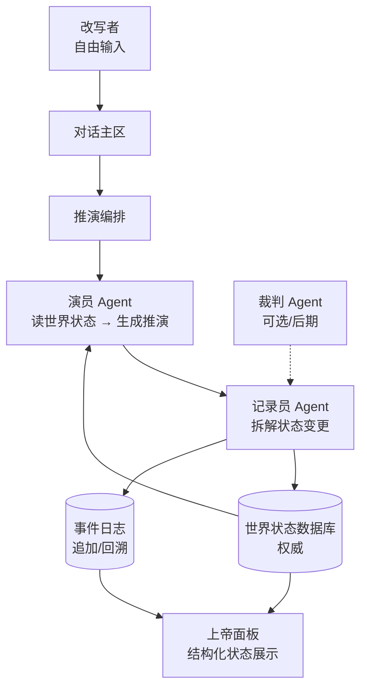

# 系统架构

> 状态：1.0 基线已确认（2026-07-12）。关联 ADR：[ADR-0006](adr/0006-ai-realtime-deduction-with-structured-state.md)（取代 ADR-0001、ADR-0003）、ADR-0002、ADR-0005。

## 项目所有者决策

- D008 AI 与世界规则的权责：1.0 由演员 Agent 实时推演结果，记录员 Agent 写回结构化状态；确定性规则裁决与裁判 Agent 留待后续。
- D009 世界状态权威来源：世界状态数据库为唯一权威；事件日志追加记录每次改写与推演，支持回溯。
- D031 多 Agent 分工：演员/记录员/裁判（可选）。
- D007/D014/D015：自研轻量编排 + DeepSeek + API 同进程（ADR-0008）。
- D016：1.0 数据存储为 SQLite（ADR-0007）。

## 架构目标

1.0 采用“AI 驱动推演，结构化数据库驱动世界状态”的分层方式。演员 Agent 读取世界状态生成推演，记录员 Agent 把推演拆解为结构化状态变更写回数据库；世界状态不依赖对话上下文记忆，事件日志保证可回溯。

## 模块

### 世界设定与入口模块

接收用户自定义世界设定，产出通用初始世界状态。它不提供预设场景，也不预测推演结果。

**Interface**：接收世界名称（可选）与设定说明（必填），构建并持久化初始世界状态。

### 对话与推演编排模块

接收用户自由文本改写，协调演员 Agent 与记录员 Agent 完成一次推演循环，把改写与推演结果写入事件日志。

**Interface**：输入改写文本与当前世界状态，输出推演叙事、结构化状态变更与事件记录。

### 演员 Agent

读取当前世界状态与改写，生成叙事推演。模型输出不是世界状态，也不是事件。

**Interface**：输入当前世界状态与改写，输出叙事推演与隐含的状态变更意图。

### 记录员 Agent

把演员 Agent 的推演结果拆解为结构化状态变更，写回世界状态数据库，并产出事件记录。变更不能应用时，状态与事件均不提交。

**Interface**：输入推演结果与当前世界状态，输出结构化状态变更与事件记录。

### 裁判 Agent（可选/后期）

检查推演前后语义矛盾。1.0 默认不启用；状态一致性在 1.0 由记录员的结构化写回和事件日志共同保证。

**Interface**：输入状态变更前后，输出矛盾报告（1.0 不接入）。

### 世界状态数据库

以结构化数据持久化人物、势力、资源、地理、关系等关键要素，是世界状态的唯一权威来源。

**Interface**：读取当前世界状态；按结构化变更更新状态。

### 事件日志（Event Log）

每次改写与推演结果作为独立事件追加记录，不可原地修改，支持按顺序回溯。

**Interface**：追加事件；按顺序读取事件。

### 上帝面板

常驻展示当前世界结构化状态。1.0 仅读取展示，不直接改写世界。具体展示内容待定（D029）。

**Interface**：读取世界状态数据库与事件日志，渲染结构化状态。

## 关键 Seams

- **模型 seam**：演员/记录员 Agent 的模型供应商可替换；领域模块不认识供应商特有类型（D014 待定）。
- **Agent 框架 seam**：1.0 不锁定 Agent 地基；演员/记录员通过明确输入输出协议交互，便于替换 Pi 或其他框架（D007 待定）。
- **存储 seam**：世界状态数据库与事件日志的存储技术可替换；1.0 不锁定具体数据库（D016 待定）。
- **面板 seam**：上帝面板是只读投影；后续可扩展为不同视图而不影响推演核心。

## 核心不变量

1. 只有记录员 Agent 能写回世界状态数据库；演员 Agent 不直接写状态。
2. 每次改写与推演必须追加为事件日志中的独立事件，不可原地修改。
3. 世界状态以结构化数据库为权威，不依赖对话上下文记忆。
4. 推演读取当前世界状态，结果可追溯到本次改写。
5. 模型、提示词或 Agent 框架升级不能静默改变已有事件日志的语义。
6. 上帝面板 1.0 只读，不构成第二条世界写入路径。
7. Agent 默认无任意网络/Shell/文件权限，仅可读写世界状态数据库与事件日志（D018）。

## 待定项

- 裁判 Agent 接入时机。
- 上帝面板具体展示内容（D029）。
- 模型调用是否迁至本仓库 Node Worker（非 Cloudflare）。
