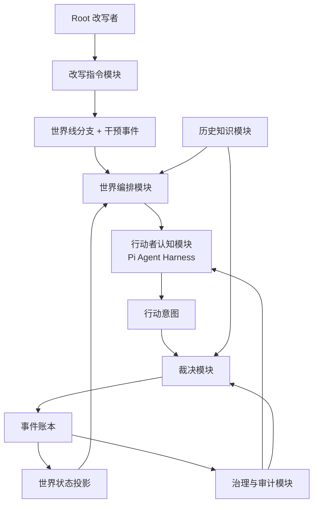

# 系统架构

> 状态：基线已确认（2026-07-12）。

## 项目所有者决策

- D007 Pi 的具体使用层级：`pi-ai` + `pi-agent-core`，按需复用 `pi-coding-agent` SDK 的会话与资源加载能力。
- D008 权责关系：Root 改写指令生成干预事件；AI 行动者提出行动意图，确定性规则裁决后续反应。
- D014 模型选择策略：Pi 多供应商抽象 + 按任务路由，避免领域层依赖供应商类型。
- D015 Pi 接入方式：同进程 TypeScript SDK + 独立 Worker；保留未来 RPC 进程隔离 seam。
- 模块划分：采用下述模块化单体作为实现基线。

## 架构目标

Sandtable 采用“Pi 驱动认知，Sandtable 驱动世界”的分层方式。Pi 提供模型接入、Agent 循环、工具调用、事件订阅和会话能力；Sandtable 定义行动者看到什么、可以提出什么，以及世界如何被裁决和记录。

## 模块

### 历史知识模块

管理史料主张、来源、置信度和冲突。它向开局构建器提供历史基线，但不预测模拟结果。

**Interface**：按历史切片查询经过标注的史料主张；构建可追溯的历史基线。

### 世界编排模块

推进模拟时刻、选择应进行认知回合的行动者、协调裁决并控制暂停与分支。它不包含具体历史规则。

**Interface**：推进、暂停、恢复、分支和重放一条世界线。

### 改写指令模块

解释改写者的自然语言或结构化 Root 指令，展示系统理解并在用户确认后创建世界线分支和干预事件。它不直接覆盖父世界线或历史基线。

**Interface**：输入改写点和改写指令，输出待确认解释；确认后输出分支身份与干预事件。

### 行动者认知模块

以 Pi 为地基，把行动者的观察、目标和可用工具交给模型，产生结构化行动意图。模型输出不是事件，也不是世界状态。

**Interface**：输入行动者观察和认知策略，输出行动意图或放弃行动。

### 裁决模块

验证行动意图的可见性、资源、制度和时间约束，计算结果并生成事件。所有世界变化集中在此，形成高 locality。

**Interface**：输入行动意图与当前世界状态，输出已接受、已拒绝或待人工复核的裁决结果。

### 事件账本

按世界线保存不可变事件、因果链、规则版本和随机性证据，是权威历史记录。

**Interface**：追加已裁决事件；按世界线和模拟时刻读取事件；验证因果与顺序不变量。

### 世界状态投影

从事件账本构建可查询的世界状态。投影可以重建，不能成为绕过事件的第二写入源。

**Interface**：在指定模拟时刻读取世界状态；从事件重建或校验投影。

### 治理与审计模块

控制工具能力、敏感行动、人工审批、来源展示和运行审计。Pi 本身不提供完整沙盒权限，因此权限策略属于 Sandtable 的显式责任。

**Interface**：在工具调用和裁决前作出允许、拒绝或需审批的决定，并保存理由。

## 关键 Seams

- **模型 seam**：通过 Pi 的统一模型层替换供应商；领域模块不认识供应商特有类型。
- **认知 seam**：Pi Agent Harness 与 Sandtable 行动意图协议之间的 seam。
- **规则 seam**：裁决模块装载不同历史切片的规则 adapter；只有出现第二套规则时才抽象公共 interface。
- **投影 seam**：同一事件账本可支持交互视图、地图和分析视图等不同投影 adapter。

## 核心不变量

1. 只有改写指令模块和裁决模块能产生改变世界的事件；前者只能产生明确标记的干预事件。
2. 事件一旦进入世界线不可原地修改；修正通过补偿事件或新世界线表达。
3. 行动者只能看到其观察允许的信息。
4. 每个关键事件都记录规则版本、输入依据和因果链。
5. 模型、提示词或 Pi 升级不能静默改变既有世界线的重放语义。
6. 历史基线与模拟事件在存储和展示语义上始终可区分。
7. Root 改写必须创建分支，不得原地修改父世界线。

## Pi 的使用范围

优先使用 Pi 的：

- `pi-ai`：统一模型接入与流式响应。
- `pi-agent-core`：有状态 Agent 循环、工具执行、事件流和工具调用前后钩子。
- `pi-coding-agent` 的 SDK/扩展机制：仅在确有会话、资源加载或项目扩展需求时采用。

不把 Pi 当作：

- 权威世界状态存储；
- 历史事实数据库；
- 裁决规则引擎；
- 安全沙盒或完整权限系统；
- 长期产品领域模型。

具体包版本在进入实现阶段时锁定；初期采用 SDK，只有安全隔离、容量或跨语言需求被测量证实时才迁移到 RPC。
