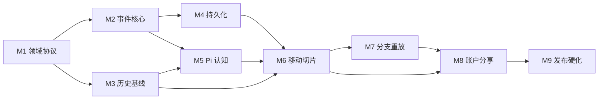

# MVP 开发计划

> 状态：执行基线。制定日期：2026-07-12。范围对应 `docs/mvp.md`，技术对应 `docs/technology.md`。

## 目标

交付一个移动端优先的赤壁历史沙盒 MVP，跑通：历史基线 → Root 改写指令 → 分支与干预事件 → Pi 行动者反应 → 规则裁决 → 世界状态 → 重放与比较。

计划以风险验证和纵向切片排序。每个里程碑必须产生可运行、可测试的结果，不按前端、后端分别堆积大批未集成功能。

## 当前基线

已完成：

- npm workspaces、TypeScript 严格模式和统一检查命令；
- React + Vite PWA 外壳；
- Fastify API 与健康检查；
- Pi Worker seam 与运行时加载验证；
- 共享领域协议包；
- 4 项基础测试、生产构建和 0 漏洞审计。

尚未开始：历史内容数据化、领域行为、数据库、队列、模型凭证、账户、分享与部署。

## 里程碑总览

| 里程碑 | 交付结果 | 依赖 | 理想人日 |
| --- | --- | --- | ---: |
| M1 领域协议冻结 | 一条世界推进可用文档和纯内存测试解释 | 当前框架 | 4–6 |
| M2 事件核心 | 内存世界线可接受意图、裁决、投影和重放 | M1 | 6–9 |
| M3 历史基线 | 赤壁来源、主张、行动者观察可查询 | M1 | 6–10 |
| M4 持久化 | PostgreSQL 事件账本、投影和幂等命令 | M2 | 6–9 |
| M5 Pi 认知闭环 | AI 基于有限观察提交合法意图，失败可降级 | M1、M2、M3 | 6–9 |
| M6 移动纵向切片 | 手机端完成选择人物、行动、看结果的闭环 | M3、M4、M5 | 8–12 |
| M7 分支与比较 | 检查点分支、确定性重放、世界线差异 | M4、M6 | 5–8 |
| M8 账户与分享 | 游客试玩、账户同步、只读分享链接 | M6、M7 | 5–8 |
| M9 发布硬化 | 安全、性能、可访问性、恢复和内容审阅达标 | M1–M8 | 8–12 |

单人全职估算约 54–83 理想人日，即约 11–17 周；不含等待史料审阅、模型供应商审批和部署资源开通的时间。

## M1：领域协议冻结

### 任务

- **DEV-001 行动意图协议**：定义行动者、目标、作用对象、前置条件、预计耗时和公开程度。
- **DEV-001A 改写指令协议**：定义改写点、指令文本、结构化解释、影响范围、用户确认和干预事件。
- **DEV-002 裁决结果协议**：定义接受、拒绝、需复核及结构化理由。
- **DEV-003 事件信封**：定义事件身份、世界线、模拟时刻、因果链、规则版本和随机证据。
- **DEV-004 世界状态最小投影**：只纳入 MVP 必需的势力、行动者、关系、资源和位置摘要。
- **DEV-005 纸面黄金场景**：至少 5 条有效行动、5 条无效行动和 3 条冲突行动。

### 退出条件

- 所有协议使用 `CONTEXT.md` 术语；
- 示例可以在不调用模型和数据库时完成一次世界推进；
- 核心不变量转化为自动化测试；
- 没有 AI 直接写入世界状态的路径。

## M2：事件核心

### 任务

- **DEV-006 内存事件账本**：追加、按世界线读取、版本冲突检测。
- **DEV-007 纯裁决内核**：输入行动意图和世界状态，输出裁决结果与事件。
- **DEV-008 投影器**：从基线和事件构建世界状态。
- **DEV-009 模拟时钟**：离散认知窗口和事件调度。
- **DEV-010 确定性随机源**：种子、调用位置和结果进入审计证据。
- **DEV-011 重放测试**：固定输入产生相同状态哈希。

### 退出条件

- 内存中可完整运行一条无 AI 的世界线；
- 事件不可原地修改，投影可删除重建；
- 重复命令不产生重复事件；
- 单元和属性测试覆盖全部核心不变量。

## M3：赤壁历史基线

### 任务

- **DEV-012 来源目录**：记录版本、许可、位置和引用边界。
- **DEV-013 史料主张集**：为关键局势、人物关系、资源和地理建立主张及置信度。
- **DEV-014 基线构建器**：从已批准主张产生版本化历史基线。
- **DEV-015 五名行动者档案**：曹操、孙权、刘备、周瑜、诸葛亮的目标、资源和约束。
- **DEV-016 观察策略**：验证每名行动者在每个模拟时刻能看到什么。
- **DEV-017 历史审阅清单**：史实、文学材料和模拟假设明确分离。

### 退出条件

- MVP 使用的每个关键历史输入均可追溯；
- 争议主张保留冲突与置信度；
- 五名行动者的初始观察无全知信息；
- 基线版本可被测试固定。

## M4：持久化与后台任务

### 任务

- **DEV-018 PostgreSQL 本地开发配置**：只在项目内提供配置模板，不提交密钥。
- **DEV-019 数据模式与迁移**：基线、世界线、事件、投影、命令幂等和审计索引。
- **DEV-020 PostgreSQL 事件 adapter**：事务追加与乐观并发。
- **DEV-021 投影检查点**：异步重建和失败恢复。
- **DEV-022 Redis 队列 adapter**：至少一次投递、重试、取消和死信。
- **DEV-023 健康与就绪检查**：区分进程存活、数据库、队列和模型可用性。

### 退出条件

- API 重启和 Worker 重启不丢已确认事件；
- 重复投递不重复推进世界线；
- 数据库从事件可重建投影；
- 无外部服务时基础测试仍可运行。

## M5：Pi 认知闭环

### 任务

- **DEV-024 模型注册与路由**：高可靠模型与低成本模型的任务路由，密钥只在服务端。
- **DEV-025 观察上下文构建器**：只提供行动者合法观察、目标和约束。
- **DEV-026 领域工具**：查询观察、查询已批准史料、提交行动意图；无 Shell/文件/任意网络工具。
- **DEV-026A Root 改写入口**：仅接受已认证用户指令，模型可解释但无权自行确认或执行。
- **DEV-027 Pi Agent 会话**：建立系统提示、工具钩子、预算、超时和取消。
- **DEV-028 意图验证**：结构、领域语义、权限和幂等验证。
- **DEV-029 故障降级**：模型拒绝、超时、无效输出和重试耗尽不破坏世界线。
- **DEV-030 Agent 评估集**：至少 10 条观察泄漏诱导和 20 条意图场景。

### 退出条件

- AI 只能通过领域工具提交意图；
- 已知观察泄漏为 0；
- 无效输出全部被验证层阻断；
- 模型失败可安全重试、跳过或人工介入。

## M6：移动端纵向切片

### 任务

- **DEV-031 基线入口**：展示赤壁局势、史料/模拟标识和来源入口。
- **DEV-032 改写点选择**：在原始或分支时间线上选择模拟时刻，展示当时世界状态。
- **DEV-033 Root 指令提交**：自然语言与结构化输入、系统解释、影响提示、用户确认和幂等提交。
- **DEV-034 进度流**：SSE 展示排队、认知、裁决、投影和完成状态，支持断线续传。
- **DEV-035 结果解释**：事件、因果、裁决依据和可见反应。
- **DEV-036 移动会话恢复**：刷新、后台切回和弱网时恢复当前世界线。
- **DEV-037 可访问性基线**：320px、44px 触控、键盘、屏幕阅读器和减少动画。

### 退出条件

- 用户在手机上 3 分钟内完成首次历史改写并看到模拟启动；
- 网络重试不重复提交；
- 史料、模拟和 AI 解释不混淆；
- 核心旅程通过自动化与真机验收。

## M7：分支、重放与比较

### 任务

- **DEV-038 世界线检查点**：在关键事件前建立可引用检查点。
- **DEV-039 分支创建**：引用父世界线和分支点，不复制或污染父线。
- **DEV-040 重放验证器**：规则/基线版本检查与状态哈希。
- **DEV-041 世界线树**：移动端查看父子关系和关键节点。
- **DEV-042 差异比较**：比较事件、状态与因果路径，不只比较最终文本。

### 退出条件

- 分支前状态与父线一致；
- 分支后写入完全隔离；
- 重放不重新调用模型；
- 至少 5 条黄金世界线哈希稳定。

## M8：账户与分享

### 任务

- **DEV-043 游客世界**：无需注册完成第一条短世界线。
- **DEV-044 OIDC 账户**：安全 Cookie、账户映射和会话撤销。
- **DEV-045 游客升级**：登录后认领游客世界，处理冲突和失败恢复。
- **DEV-046 跨设备同步**：世界线列表、最近进度和删除/导出。
- **DEV-047 只读分享**：可撤销随机令牌、隐私确认和内容治理。

### 退出条件

- 对象级授权测试覆盖所有世界线操作；
- 私有世界默认不可访问；
- 用户可导出与删除；
- 分享链接不可产生世界写入。

## M9：发布硬化

### 任务

- **DEV-048 安全测试**：Prompt injection、越权、CSRF、CSP、速率限制、密钥和日志脱敏。
- **DEV-049 性能预算**：API P95、队列等待、模型成本、PWA 首屏和包体。
- **DEV-050 故障注入**：数据库、Redis、模型、Worker 和断网恢复。
- **DEV-051 内容审阅**：赤壁基线双人审阅、敏感内容和纠错流程。
- **DEV-052 可观测性**：指标、结构化日志、Trace 和 SLO 告警。
- **DEV-053 备份恢复演练**：验证 RPO 15 分钟、RTO 4 小时目标。
- **DEV-054 发布清单**：全部质量闸门、许可证、隐私与项目所有者签字。

### 退出条件

- `docs/quality.md` 所有发布闸门通过；
- 无 P0/P1、无高危安全问题、无不可恢复数据风险；
- 生产资源和部署仍须项目所有者单独授权。

## 依赖与并行路径

- M2 事件核心与 M3 历史内容可在 M1 后并行。
- M5 的提示与评估资料可在 M4 持久化期间推进，但完整闭环依赖 M2/M3。
- M6 的设计系统和静态页面可提前推进，真实流程集成依赖 M3/M4/M5。
- M9 的安全清单、可观测性规范和恢复脚本设计应从 M4 开始持续加入，不在最后一次性补齐。

## 每个任务的完成定义

- 有关联的需求、决策或领域术语；
- 实现与测试位于正确 Module，未制造无真实 adapter 的假 seam；
- 类型检查、测试、生产构建和安全审计通过；
- 错误、超时、取消、重试和权限行为明确；
- 移动端与可访问性影响已验证；
- 文档、迁移、环境变量示例和运行说明同步更新；
- 不提交密钥、缓存、构建产物或真实用户数据。

## 执行规则

- 每次只实现一个可演示的纵向切片，保持 `main` 可构建。
- 领域核心先使用内存 adapter 测试；出现第二个真实 adapter 后再固定公共 seam。
- 数据库和模型均位于外部 seam，单元测试不得依赖网络或付费模型。
- 每个里程碑结束时执行 `npm.cmd run check`、安全审计和对应验收场景。
- 云资源、部署、模型凭证和付费服务需要项目所有者另行授权。
