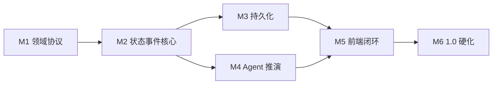

# 1.0 开发计划

> 状态：执行基线。制定日期：2026-07-12。范围对应 `docs/mvp.md`，技术对应 `docs/technology.md`。1.0 不做过度设计。

## 目标

交付 1.0 闭环：选择场景 → 自由输入改写 → AI 根据世界状态推演 → 记录员写回结构化状态 → 事件日志回溯。

计划以风险验证与纵向切片排序。每个里程碑必须产生可运行、可测试的结果，不按前端、后端分别堆积未集成功能。

## 当前基线

已完成：

- npm workspaces、TypeScript 严格模式和统一检查命令；
- React + Vite 前端外壳；
- Fastify API 与健康检查；
- Node Worker 框架入口与运行时加载验证；
- 共享领域协议包；
- 基础测试、生产构建和审计。

已完成（M1–M6）：领域协议、持久化、Agent、前端闭环、硬化（幂等/限流/校验/指标/发布清单）。

尚未开始：生产部署授权、所有者发布签字。

待定决策：无阻塞 1.0 核心路径的必选定（D007/D014/D015/D016 已确认）。

## 里程碑总览

| 里程碑            | 交付结果                                                            | 依赖                     |
| ----------------- | ------------------------------------------------------------------- | ------------------------ |
| M1 领域协议冻结   | 世界状态与事件日志最小 schema、Agent 输入输出协议、纯内存测试解释   | 当前框架                 |
| M2 状态与事件核心 | 内存世界状态数据库 + 事件日志，可接收改写、写回状态、追加事件、回溯 | M1                       |
| M3 持久化         | 按 D016 落地存储；幂等提交与事务一致                                | M2、D016                 |
| M4 Agent 推演闭环 | 演员 Agent 读状态生成推演；记录员 Agent 写回结构化状态；失败可降级  | M1、M2、D007、D014、D015 |
| M5 前端闭环       | 对话主区 + 上帝面板并列；选择场景 → 自由输入 → 看推演 → 看状态      | M3、M4                   |
| M6 1.0 硬化       | 重复提交、超时、断网、Worker 重启不破坏一致性；发布闸门通过         | M1–M5                    |

## M1：领域协议冻结

### 任务

- **DEV-001 世界状态最小 schema**：人物、势力、资源、地理、关系等关键要素的最小结构化定义。
- **DEV-002 事件日志最小 schema**：改写、推演叙事、结构化状态变更、模拟时刻、记录时刻、因果。
- **DEV-003 演员 Agent 协议**：输入当前世界状态与改写，输出叙事推演与隐含状态变更意图。
- **DEV-004 记录员 Agent 协议**：输入推演结果与当前世界状态，输出结构化状态变更与事件记录。
- **DEV-005 纸面黄金场景**：至少一个预设场景的初始世界状态，及数条不同颗粒度的改写样例（含“那天江上刮西北风”级细节）。

### 退出条件

- 所有协议使用 `CONTEXT.md` 术语；
- 示例可在不调用模型与数据库时完成一次改写-推演-写回-回溯；
- 核心不变量转化为自动化测试；
- 演员 Agent 没有直接写世界状态的路径。

## M2：状态与事件核心

### 任务

- **DEV-006 内存世界状态数据库**：按要素查询与更新当前世界状态。
- **DEV-007 内存事件日志**：只追加、不可原地修改、按顺序读取与回溯。
- **DEV-008 推演编排**：接收改写，调用（内存桩）演员/记录员 Agent，写回状态并追加事件。
- **DEV-009 幂等提交**：重复改写不重复产生事件。
- **DEV-010 回溯测试**：按事件日志顺序还原改写-推演历史。

### 退出条件

- 内存中可完整运行一条改写-推演-写回-回溯链路；
- 世界状态写入与事件追加位于同一逻辑事务；
- 重复命令不产生重复事件；
- 单元测试覆盖核心不变量。

## M3：持久化

### 任务

- **DEV-011 存储落地**：按 D016 实现世界状态数据库与事件日志的持久化 adapter。
- **DEV-012 数据 schema 与迁移**：世界状态与事件日志的最小表结构/文档结构。
- **DEV-013 事务一致**：状态写入与事件追加同事务。
- **DEV-014 健康与就绪检查**：区分进程存活与存储可用性。

### 退出条件

- API 重启和 Worker 重启不丢已确认事件；
- 重复投递不重复推进世界状态；
- 无外部服务时基础测试仍可运行。

## M4：Agent 推演闭环

### 任务

- **DEV-015 模型接入**：按 D007、D014、D015 接入模型；密钥只在服务端。
- **DEV-016 演员 Agent 实现**：读取当前世界状态与改写，生成叙事推演。
- **DEV-017 记录员 Agent 实现**：把推演结果拆解为结构化状态变更，写回世界状态数据库与事件日志。
- **DEV-018 状态一致性校验**：写回前后世界状态不矛盾（裁判 Agent 1.0 可不接入，最小校验在记录员或编排层）。
- **DEV-019 故障降级**：模型拒绝、超时、无效输出和重试耗尽不破坏世界状态与事件日志。

### 退出条件

- 演员 Agent 只读世界状态，记录员 Agent 集中写回；
- 推演后世界状态无已知矛盾；
- 模型失败可安全重试、跳过或人工介入。

## M5：前端闭环

### 任务

- **DEV-020 场景入口**：选择预设场景或输入自定义背景，加载初始世界状态。
- **DEV-021 对话主区**：自由文本输入改写，展示 AI 推演叙事。
- **DEV-022 上帝面板**：常驻展示当前世界结构化状态（最小内容），与对话主区并列。
- **DEV-023 推演进度流**：SSE 展示推演进度，支持断线续传。
- **DEV-024 事件日志回溯视图**：按顺序查看每次改写与推演。
- **DEV-025 会话恢复**：刷新、后台切回和弱网时恢复当前会话状态。

### 退出条件

- 用户可完成：选择场景 → 自由输入改写 → 看到推演 → 上帝面板同步状态 → 查看回溯；
- 网络重试不重复提交；
- 推演内容不伪装为史实（基础标识）。

## M6：1.0 硬化

### 任务

- **DEV-026 重复提交与幂等**：网络重试不重复产生事件。
- **DEV-027 超时与降级**：模型超时、断网安全重试或降级。
- **DEV-028 故障注入**：存储、模型、Worker 和断网恢复不破坏一致性。
- **DEV-029 安全基线**：输入校验、输出编码、速率限制、密钥与日志脱敏、Prompt injection 隔离。
- **DEV-030 可观测性**：指标、结构化日志与基础告警。
- **DEV-031 发布清单**：`docs/quality.md` 发布闸门、许可证与项目所有者签字。

### 退出条件

- `docs/quality.md` 所有发布闸门通过；
- 无 P0/P1、无高危安全问题、无不可恢复数据风险；
- 生产资源和部署仍须项目所有者单独授权。

## 依赖与并行路径

- M3 与 M4 可在 M2 后并行（M4 可先用内存桩，再接真实模型）。
- M5 的静态布局与场景入口可提前推进，真实推演集成依赖 M3/M4。
- M6 的安全清单与可观测性规范应从 M3 开始持续加入，不在最后一次性补齐。

## 每个任务的完成定义

- 有关联的需求、决策或领域术语；
- 实现与测试位于正确 Module，未制造无真实 adapter 的假 seam；
- 类型检查、测试、生产构建和安全审计通过；
- 错误、超时、取消、重试和权限行为明确；
- 文档、迁移、环境变量示例和运行说明同步更新；
- 不提交密钥、缓存、构建产物或真实用户数据。

## 执行规则

- 每次只实现一个可演示的纵向切片，保持 `main` 可构建。
- 领域核心先使用内存 adapter 测试；出现第二个真实 adapter 后再固定公共 seam。
- 数据库和模型均位于外部 seam，单元测试不得依赖网络或付费模型。
- 每个里程碑结束时执行 `npm.cmd run check`、安全审计和对应验收场景。
- 云资源、部署、模型凭证和付费服务需要项目所有者另行授权。
