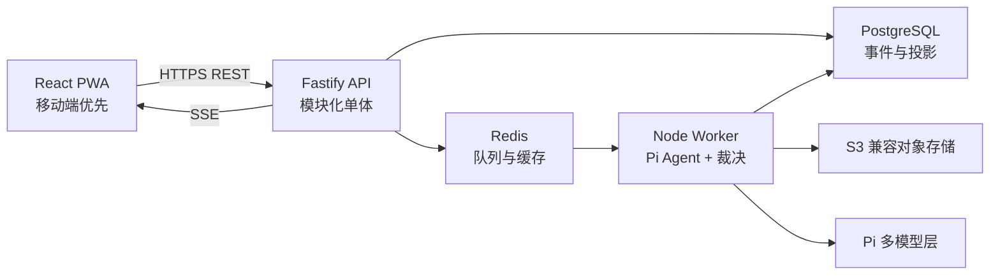

# 技术基线

> 状态：架构基线已确认；具体版本在进入实现阶段时锁定。本文不包含实现代码。

## 总体形态

采用 TypeScript 端到端的模块化单体，前端、HTTP 后端和后台 Worker 分别部署，但共享领域协议。早期避免微服务；只有容量、隔离或团队所有权出现真实差异时才拆分。

## 前端

- React + TypeScript：成熟生态、组件模型清晰、适合交互密集 Web UI。
- Vite：轻量构建与开发基线，不把产品绑定到全栈框架。
- PWA：主屏安装、应用壳缓存、更新提示和网络恢复；世界推进仍以服务端为准。
- 路由：客户端路由，历史切片和分享页可按需预渲染以改善首屏与分享元数据。
- 数据：服务端状态使用查询缓存层；短期 UI 状态保持本地，权威世界状态不落入全局前端 store。
- 样式：设计 Token + CSS 变量 + 可访问的无样式基础控件；工具类 CSS 仅用于布局和视觉实现。
- 流式更新：SSE；只有未来出现双向实时协作才引入 WebSocket。

## 后端

- Node.js LTS + TypeScript，与 Pi 共享运行时和类型，减少跨语言适配。
- Fastify 作为 HTTP 框架，提供低开销、Schema 驱动验证和清晰插件封装。
- 模块化单体：身份、历史知识、世界、裁决、Agent、分享和治理按领域模块组织。
- REST：创建意图、查询世界、管理分支等明确资源操作。
- SSE：认知、裁决和投影的进度流；支持断线后按事件 ID 续传。
- Worker：执行 Pi 认知回合、裁决、投影和导出；API 请求不等待长模型调用。

## Pi 集成

- `pi-ai` 负责多模型接入和流式响应。
- `pi-agent-core` 负责 Agent 状态、工具调用、事件流和调用前后钩子。
- `pi-coding-agent` SDK 只复用会话、资源加载或运行模式，不启用通用 Shell/文件工具。
- 每个行动者认知回合使用领域工具允许列表和专属观察上下文。
- 初期同进程 SDK 获得类型安全和最低延迟；Agent 模块保持可迁移到 RPC/隔离进程的 interface。

## 数据与基础设施

- PostgreSQL 为唯一权威数据库；JSONB 只承载演化中的事件载荷，关键查询字段结构化。
- Redis 只用于队列、缓存、速率限制和短期协调。
- S3 兼容对象存储保存附件和导出物。
- 前端静态资源走 CDN；API、Worker、PostgreSQL 和 Redis 初期同区域部署。
- 使用 OCI 容器保持云厂商可迁移性；托管服务选择以中国目标用户的实际可达性、合规和延迟测试为准。

## 明确不采用

- MVP 不采用微服务、Kubernetes、独立事件总线、GraphQL 或多数据库写模型。
- 不把浏览器作为权威模拟运行时。
- 不直接从前端调用模型供应商。
- 不在文档阶段锁具体版本、云供应商或付费套餐。

