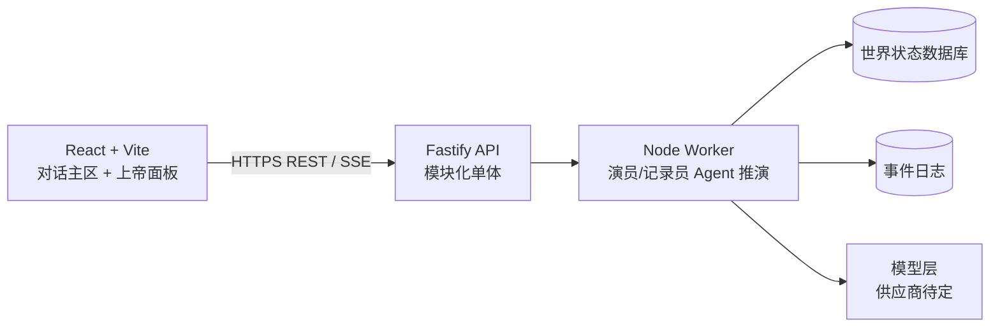

# 技术基线

> 状态：1.0 架构方向已确认。D007/D014/D015/D016 已确认（ADR-0007、ADR-0008）。实际版本以 `package-lock.json` 为准。

## 总体形态

采用 TypeScript 端到端的模块化单体，前端、HTTP 后端和后台 Worker 分别部署，但共享领域协议。早期避免微服务；只有容量、隔离或团队所有权出现真实差异时才拆分。

## 前端（D022 已确认）

- React + TypeScript：成熟生态、组件模型清晰、适合对话 + 面板并列布局。
- Vite：轻量构建与开发基线，不把产品绑定到全栈框架。
- 布局：对话主区与上帝面板并列；具体平台优先级待定（D002）。
- 数据：服务端状态使用查询缓存层；权威世界状态不落入全局前端 store，只读展示。
- 流式更新：SSE 展示推演进度；只有未来出现双向实时协作才引入 WebSocket。

## 后端

- Node.js LTS + TypeScript。
- Fastify 作为 HTTP 框架，提供低开销、Schema 驱动验证和清晰插件封装。
- 模块化单体：场景入口、对话与推演编排、Agent、世界状态、事件日志、上帝面板查询按领域模块组织。
- REST：提交改写、查询世界状态、查询事件日志等明确资源操作。
- SSE：推演进度流；支持断线后按事件 ID 续传。
- Worker：执行演员/记录员 Agent 推演；API 请求不等待长模型调用。

## Agent 与模型（D007 / D014 / D015）

- 1.0 采用演员/记录员/裁判（可选）多 Agent 分工（D031）。
- **D007**：自研轻量编排（`packages/agents` 实现领域接口）。
- **D014**：DeepSeek；`https://api.deepseek.com`；`DEEPSEEK_API_KEY`；默认 `deepseek-v4-flash`。
- **D015**：API 同进程 SDK；非 Cloudflare Workers。
- 演员/记录员通过明确输入输出协议交互；领域模块不认识供应商特有类型。
- Agent 默认无任意网络/Shell/文件权限，仅可读写世界状态数据库与事件日志（D018）；模型 HTTP 仅服务端出站。
- 无密钥或 `SANDTABLE_AGENT_MODE=stub` 时回退内存桩。

## 数据与基础设施

- 数据存储技术：**SQLite**（D016，ADR-0007）。Node `node:sqlite`；文件默认在项目 `data/` 下。
- 1.0 不锁云供应商或付费套餐；不创建云端数据库资源。
- 不把浏览器作为权威世界状态运行时。
- 不直接从前端调用模型供应商。

## 明确不采用（1.0）

- 不采用微服务、Kubernetes、独立事件总线、GraphQL 或多数据库写模型。
- 不做确定性重放引擎、规则裁决模块、权限分层与迷雾机制（留待后续）。
- 不把对话上下文当作世界状态权威来源。
