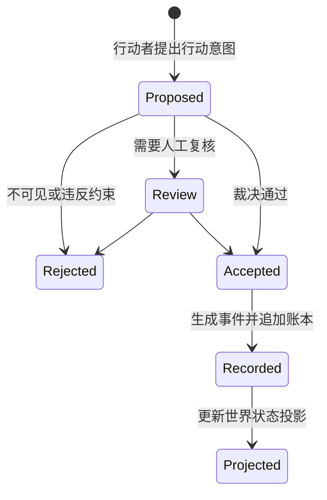

# 世界时间与事件模型

> 状态：基线已确认（2026-07-12）。

## 项目所有者决策

- D009 权威世界状态模型：事件账本为权威记录，世界状态为可重建投影。
- D011 时间推进方式：离散事件调度，认知窗口可对应不同历史时长。
- D012 冲突行动裁决方式：冻结同窗观察和意图后统一裁决，使用因果优先级、行动耗时和确定性种子。
- D013 分支与重放保证：基线、规则版本、事件、输入和随机种子齐备时确定性重放。

## 双层现实

Sandtable 同时维护两类不可混淆的信息：

- **历史基线**：开局前被采信的史料主张。
- **模拟历史**：开局后经裁决进入某条世界线的事件。

模拟可以引用历史基线，但不能反向改写来源。若史料判断改变，应创建新的基线版本，再从该基线产生世界线。

## 时间

系统至少区分：

- **模拟时刻**：事件在世界内部发生的时间。
- **记录时刻**：事件被系统接受和持久化的现实时间。
- **认知顺序**：并发行动意图被观察、裁决和公开的顺序。

三者不得用一个字段代替。首个 MVP 可以采用离散推进，但领域文档不把“回合制”固化为永久假设。

## 事件最小语义

每个事件概念上应包含：

- 身份与所属世界线；
- 模拟时刻与记录时刻；
- 事件类型及领域载荷；
- 引发它的行动意图或系统原因；
- 前置事件与因果链；
- 裁决规则版本；
- 不确定性与随机种子证据（如适用）；
- 历史来源引用（如适用）。

这是一份语义要求，不是代码结构或数据库表设计。

## 行动生命周期

## 分支与重放

- 分支引用父世界线和分支点，不复制“真相”的定义。
- 重放以历史基线版本、事件序列、规则版本和随机性证据为输入。
- AI 的原始自然语言可保留用于审计，但世界重放依赖已裁决事件，不依赖重新调用模型。
- 如果旧规则无法继续重放，必须显式迁移或冻结该世界线，不允许静默使用新规则解释旧事件。

## 一致性策略

首阶段优先可解释与确定性，而非大规模实时并发。同一模拟时刻的冲突行动应进入明确的排序或冲突裁决流程；具体策略在 MVP 历史切片确定后再记录 ADR。
