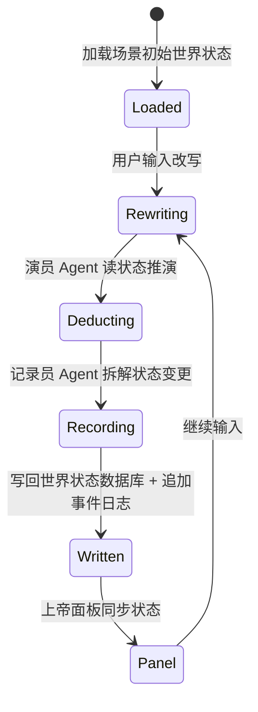

# 世界状态与事件模型

> 状态：1.0 基线已确认（2026-07-12）。关联决策：D009、D011、D012、D013。关联 ADR：ADR-0002、ADR-0006。

## 项目所有者决策

- D009 世界状态权威来源：世界状态数据库为唯一权威；事件日志追加记录每次改写与推演，支持回溯。
- D011 时间推进方式：1.0 采用对话式实时推演，按改写-推演循环推进；离散事件调度与认知窗口留待后续。
- D012 冲突裁决：1.0 单人单会话，不涉及并发冲突裁决；冲突排序与确定性种子留待后续。
- D013 分支与重放：1.0 为单条演进世界线 + 事件日志回溯；显式世界线分支与确定性重放留待后续。

## 世界状态

- 世界状态是某个推演时刻由结构化数据描述的世界快照，包含人物、势力、资源、地理、关系等关键要素。
- 世界状态以**世界状态数据库**为唯一权威来源，不依赖对话上下文记忆。
- 推演读取当前世界状态，结果由记录员 Agent 写回，形成新的当前世界状态。

## 事件日志（Event Log）

- 每次改写与推演结果作为独立事件追加记录，不可原地修改。
- 事件按追加顺序保存，支持历史回溯。
- 事件概念上应包含：
  - 身份与所属会话/世界线；
  - 模拟时刻与记录时刻；
  - 改写文本与推演叙事；
  - 结构化状态变更；
  - 引发它的改写与前置事件（因果）；
  - 模型与 Agent 版本（如适用）。
- 这是一份语义要求，不是代码结构或数据库表设计。

## 改写-推演循环

## 时间

1.0 至少区分：

- **模拟时刻**：事件在推演内部发生的时间。
- **记录时刻**：事件被系统持久化的现实时间。

1.0 采用对话式实时推进，按改写-推演循环递进；离散事件调度、认知窗口与并发排序留待后续。

## 一致性策略（1.0）

- 1.0 为单人单会话，按顺序处理改写-推演，不涉及并发冲突。
- 状态一致性主要由记录员 Agent 的结构化写回与事件日志保证。
- 裁判 Agent（矛盾检查）1.0 默认不启用；确定性规则裁决留待后续。
- 同一输入不保证产生相同结果（1.0 不做确定性重放）。

## 回溯（1.0）

- 1.0 支持按事件日志顺序回溯历史改写-推演。
- 显式世界线分支、检查点与确定性重放留待后续（D013）。

## 待定项

- 世界状态数据库的具体 schema（与 D016 一并确定）。
- 事件日志的最小字段集与存储格式。
- 模拟时刻的表示与推进粒度。
